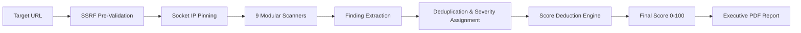

# WebShield System Architecture & Lifecycle

This document provides a technical deep-dive into the system architecture, component topology, request lifecycle, data flow, and security boundaries of the **WebShield Web Security Assessment Platform**.

---

## 1. System Topology & Monorepo Structure

WebShield is architected as a modular TypeScript monorepo managed via `pnpm` workspaces:

```text
                               ┌─────────────────────────┐
                               │   Web Client (SPA)      │
                               │   React 18 / Vite 5     │
                               │   Port 5173 (Dev)       │
                               └────────────┬────────────┘
                                            │ HTTP / JSON
                                            │ (Bearer JWT / HttpOnly Cookie)
                                            ▼
                               ┌─────────────────────────┐
                               │   Express API Gateway   │
                               │   Port 5000 (Dev)       │
                               └───────┬──────────┬──────┘
                                       │          │
                     ┌─────────────────┘          └─────────────────┐
                     ▼                                              ▼
       ┌───────────────────────────┐                  ┌───────────────────────────┐
       │   @webshield/             │                  │   Prisma ORM 5            │
       │   security-engine         │                  │   PostgreSQL 15+          │
       │   (Isolated Assessment)   │                  │   (Persistent Storage)    │
       └─────────────┬─────────────┘                  └───────────────────────────┘
                     │
                     ▼ (SSRF-Guarded HTTP/HTTPS)
       ┌───────────────────────────┐
       │   External Web Target     │
       └───────────────────────────┘
```

### High-Level System Flow

```text
Frontend ──► API Gateway ──► Authentication / Authorization ──► Application Services ──► Scanner Engine ──► Database ──► Reporting
```

### Workspace Packages

| Package | Path | Responsibility | Dependencies |
| :--- | :--- | :--- | :--- |
| `@webshield/web` | `apps/web` | React Single Page Application (Dashboard, Scanner, Admin UI) | React, React Router, TanStack Query, Recharts, Tailwind CSS |
| `@webshield/api` | `apps/api` | REST API Server, Auth, RBAC, Scan Orchestration, PDF Reporting | Express, Prisma Client, Argon2, JWT, PDFKit, Helmet |
| `@webshield/security-engine` | `packages/security-engine` | Passive Security Scanners, SSRF Guard, IP Pinning, Scoring | Node.js Native HTTP/HTTPS, DNS, Crypto |
| `@webshield/shared` | `packages/shared` | Shared TypeScript data models, enums, DTO definitions | None |

---

## 2. Request Lifecycle & Middleware Chain

Every HTTP request handled by `@webshield/api` traverses a deterministic, multi-layered security pipeline:

```mermaid
graph TD
    A[Incoming Request] --> B[requestId: Tag / Sanitize X-Request-ID]
    B --> C[helmet: Strict Security Headers]
    C --> D[cacheControl: No-Store for API Responses]
    D --> E[cors: Whitelisted Origin Validation]
    E --> F[cookieParser & express.json: Body Parsing]
    F --> G[rateLimiter: Route-Specific Thresholds]
    G --> H{Requires Auth?}
    H -- Yes --> I[authenticate: JWT Verification & Suspended Status Check]
    I --> J{Requires Admin?}
    J -- Yes --> K[requireRole('ADMIN'): RBAC Gate]
    J -- No --> L[Controller Execution]
    K --> L
    H -- No --> L
    L --> M[Service Layer & Business Invariants]
    M --> N[Prisma ORM / Security Engine]
    N --> O[Structured Success Response]
    L -- Error --> P[Centralized errorHandler: Sanitize & Format JSON]
```

### Layer Details

1. **Request Correlation (`requestId`)**:
   - Generates or sanitizes `X-Request-ID` (UUIDv4) attached to `req.id` and reflected on response headers.
2. **Security Headers (`helmet`)**:
   - Injects `Strict-Transport-Security` (1-year preload), `X-Frame-Options: DENY`, `X-Content-Type-Options: nosniff`, and `Referrer-Policy`.
3. **Anti-Caching Policy**:
   - Mandates `Cache-Control: no-store, no-cache, must-revalidate, private` on all authenticated API responses.
4. **CORS Enforcement**:
   - Verifies `Origin` against whitelisted comma-separated domain list. Non-conforming origins receive `403 CORS_ORIGIN_NOT_ALLOWED`.
5. **Multi-Tier Rate Limiting**:
   - `authRateLimit`: 15 requests / 15 minutes per IP.
   - `scanRateLimit`: 10 scans / 10 minutes per IP.
   - `reportRateLimit`: 10 PDF generations / 10 minutes per IP.
   - `adminRateLimit`: 60 administrative mutations / 15 minutes per IP.
6. **Authentication (`authenticate`)**:
   - Validates Bearer access token signature against `JWT_SECRET`.
   - Queries database to verify user existence and active status (`isSuspended === false`).
7. **Authorization (`requireRole`)**:
   - Verifies `req.user.role === 'ADMIN'`. Rejects unauthorized users with `403 FORBIDDEN`.

---

## 3. Assessment & Scoring Lifecycle

The assessment lifecycle processes targets from initial input to final report:

```text
Scan ──► Security Checks ──► Findings ──► Risk / Severity ──► Security Score ──► Report
```



### Modular Scanners

1. **`httpsScanner`**: Validates HTTPS redirection, HTTP-to-HTTPS upgrade paths, and plaintext transmission risks.
2. **`headersScanner`**: Inspects Content-Security-Policy (CSP), HSTS, X-Frame-Options, X-Content-Type-Options, Referrer-Policy, and Permissions-Policy.
3. **`cookieScanner`**: Audits `Set-Cookie` directives for missing `Secure`, `HttpOnly`, and `SameSite` flags.
4. **`corsScanner`**: Evaluates `Access-Control-Allow-Origin: *` and credential exposure risks (`Access-Control-Allow-Credentials: true`).
5. **`informationDisclosureScanner`**: Checks for leaked `Server`, `X-Powered-By`, `X-AspNet-Version`, and debug banners.
6. **`technologyScanner`**: Fingerprints underlying web frameworks (Express, Django, Laravel, ASP.NET, WordPress) non-intrusively.
7. **`tlsScanner`**: Assesses TLS protocol versions (TLS 1.2, 1.3 vs deprecated 1.0, 1.1) and cipher suites.
8. **`wellKnownScanner`**: Checks security contact publications (`/.well-known/security.txt`).
9. **`dnsScanner`**: Inspects basic DNS configurations and canonical records.

---

## 4. Reporting Architecture & PDF Generation

PDF generation uses a streaming, memory-bounded architecture powered by `PDFKit`:

```text
[Completed Scan Record]
         │
         ▼
[Report Data Builder] (Redacts sensitive cookies, passwords, bearer tokens)
         │
         ▼
[PDFKit Generator] (A4 Stream with Corporate Blue Styling)
         ├── Page 1: Cover Page, Confidentiality Banner & Score Badge
         ├── Page 2: Executive Summary & Score Deduction Matrix
         ├── Page 3+: Findings Catalog (Severity, Evidence, Remediation)
         └── Final Page: Methodology, Limitations & Legal Disclaimer
         │
         ▼
[File Stream] ───► [apps/api/storage/reports/{reportId}.pdf]
         │
         ▼
[Secure HTTP Download] (Content-Disposition: attachment, CSP: default-src 'none')
```

---

## 5. Security Invariants & Isolation Guarantees

1. **Multi-Tenant Data Isolation (IDOR Defense)**:
   - Every read/write query for scans, targets, and reports includes `userId === req.user.id`.
2. **Self-Protection & Last-Admin Defense**:
   - `SELF_SUSPENSION_BLOCKED`: Admins cannot suspend their own accounts.
   - `SELF_DEMOTION_BLOCKED`: Admins cannot remove their own admin privileges.
   - `LAST_ADMIN_PROTECTED`: System prohibits modifying or suspending the sole active admin.
3. **Instant Session Invalidation**:
   - Account suspension sets `isSuspended = true` and revokes all active refresh tokens.
   - Subsequent API requests fail immediately at the `authenticate` middleware layer.
4. **Append-Only Audit Trail**:
   - Audit logs (`audit_logs` table) have no update or delete API endpoints.
